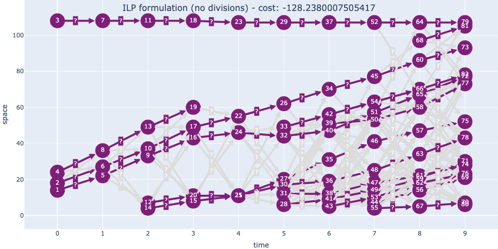

# Exercise 9 - Tracking

This exercise was created by Benjamin Gallusser and Albert Dominguez Mantes,
and updated for 2024 by Caroline Malin-Mayor.



## Objective:
- Write a pipeline that takes in cell detections and links them across time to obtain lineage trees


## Setup
1. Go into the folder with this repo and run
    ```
    source setup.sh
    ```
    to set up the environment for this exercise. This will take a few minutes.
   
2. Run
    ```
    jupyter lab
    ```
    , double-click on the `exercise.ipynb` files and follow the instructions in the notebook.
    
    Alternatively, open `exercise.ipynb` in VSCode with the jupyter extension and the `09-tracking` environment activated.


## Overview: Tracking by detection with an integer linear program (ILP)

### Methods/Tools:

- **`networkx`**: To represent the tracking inputs and outputs as graphs. Tracking is often framed
    as a graph optimization problem. Nodes in the graph represent detections, and edges represent links
    across time. The "tracking" task is then framed as selecting the correct edges to link your detections.
- **`motile`**: To set up and solve an Integer Lineage Program (ILP) for tracking.
    ILP-based methods frame tracking as a constrained optimization problem. The task is to select a subset of nodes/edges from a "candidate graph" of all possible nodes/edges. The subset must minimize user-defined costs (e.g. edge distance), while also satisfying a set of tracking constraints (e.g. each cell is linked to at most one cell in the previous frame). Note: this tracking approach is not inherently using
    "deep learning" - the costs and constraints are usually hand-crafted to encode biological and data-based priors, although cost features can also be learned from data.
- **`napari`**: To visualize tracking inputs and outputs. Qualitative analysis is crucial for tuning the 
    weights of the objective function and identifying data-specific costs and constraints.
- **`traccuracy`**: To evaluate tracking results. Metrics such as accuracy can be misleading for tracking,
    because rare events such as divisions are much harder than the common linking tasks, and might
    be more biologically relevant for downstream analysis. Therefore, it is important to evaluate on
    a wide range of error metrics and determine which are most important for your use case.

After running through the full tracking pipeline, from loading to evaluation, we will learn how to **incorporate custom costs** based on dataset-specific prior information. As a bonus exercise, 
you can learn how to **learn the best cost weights** for a task from
from a small amount of ground truth tracking information.

### Bonus: Tracking with two-step Linear Assignment Problem (LAP)

There is a bonus notebook showing how to use a two-step linking algorithm implemented in the Fiji plugin TrackMate. We will not go over this in the exercise time, but it is available for those who are interested in learning on their own.

You will learn
- how to use **Trackmate**, a versatile ready-to-go implementation of two-step LAP tracking in `ImageJ/Fiji`.
